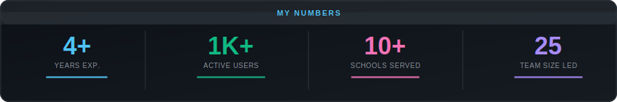
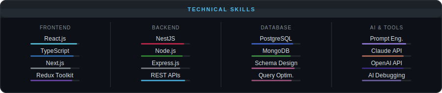

<div align="center">


<br/>

[](https://www.linkedin.com/in/aloksjaiswal/)
[](https://github.com/Alok-jaiswal)
[](https://alokjaiswal-dev.onrender.com/)
[](mailto:alokasha7620@gmail.com)

<br/>


</div>

---

## 👨‍💻 About Me

I'm a **Full Stack Developer** with **4+ years** of experience building enterprise-grade web applications that scale. I've led development of **4 core ERP modules** within a **25-member engineering team** — serving **1,000+ users across 10+ schools** in production.

I don't just write code — I think in systems. Whether it's a document management pipeline with OCR, a dynamic form engine, or role-based auth — I build things that are maintainable a year from now, not just functional today.

What sets me apart: I actively use **AI tools and prompt engineering** as a core part of my workflow — not as a shortcut, but as a genuine multiplier for speed, quality, and problem-solving.

```
📍 Nagpur, Maharashtra    💼 Open to Opportunities    ⚡ Available for Freelance
```

---

## 📊 My Numbers

<div align="center">



</div>

---

## 🚀 What I Bring to the Table

| Capability | Details |
|:---|:---|
| 🎨 **Frontend** | React.js, Next.js, TypeScript, Redux Toolkit, Tailwind CSS, Bootstrap |
| ⚙️ **Backend** | Node.js, Express.js, NestJS — microservices & REST APIs |
| 🗄️ **Database** | PostgreSQL (pgAdmin), MongoDB — schema design & query optimization |
| 🤖 **AI Integration** | Claude API, OpenAI API, prompt engineering, AI-assisted workflows |
| 🔐 **Auth & Security** | JWT, Refresh Tokens, Role-Based Access Control (RBAC) |
| 🛠️ **Tools** | Git/GitHub, Postman, OCR integration, Third-Party APIs |

---

## 🛠️ Tech Stack

<div align="center">



<br/>


</div>

---

## 💼 Work Experience

### 🏢 PERLA IT Information Technology & Services Pvt. Ltd.
**Software Developer — Full Stack** &nbsp;|&nbsp; `June 2022 – Present`

> *B2B SaaS company building ERP solutions for educational institutions across Maharashtra*

- 🎯 Led development of **4 core ERP modules** (Exam, Results, Timetable, Grading) within a **25-member team** — serving **1,000+ users across 10+ schools**
- ⚛️ Architected scalable **React.js + TypeScript** frontend with reusable component libraries
- 🔧 Built high-performance **NestJS microservices** and REST APIs with optimized server-side logic
- 🗄️ Designed and tuned **PostgreSQL schemas** using pgAdmin for data-heavy ERP operations
- 📄 Implemented a full **Document Management System** with OCR processing, auto-classification, duplicate detection, and versioning
- 🤖 Integrated **AI APIs (Claude, OpenAI)** to accelerate feature delivery and add intelligent capabilities
- ✍️ Applied **structured prompt engineering** to diagnose complex bugs — reducing debugging cycles across the team
- 🔗 Leveraged **AI agent workflows** for research, code generation, and technical problem-solving


---

### 🎨 The Space Element Design Studio and Development Lab
**Frontend Developer** &nbsp;|&nbsp; `Nov 2021 – May 2022`

> *Digital design and development studio focused on responsive web experiences*

- ⚡ Optimized caching strategies — cut **page load times by 50%** and boosted **user engagement by 25%**
- 🤝 Led cross-functional collaboration that reduced **time-to-market by 20%**
- 🛠️ Built responsive websites using HTML, CSS, SCSS, React.js, and Redux


---

## 🏗️ Featured Projects

<table>
<tr>
<td width="50%" valign="top">

### 🏫 School ERP Management System
Enterprise ERP platform serving **1,000+ users** across **10+ schools** in production

**Modules:** Exam Management · Result Processing · Timetable Scheduling · Grading


</td>
<td width="50%" valign="top">

### 📄 Document Management System
Full document lifecycle — OCR extraction, auto-classification, duplicate detection, versioning & dynamic templates


</td>
</tr>
<tr>
<td width="50%" valign="top">

### 📋 Dynamic Form Builder
Drag-and-drop builder — text, dropdowns, checkboxes, image uploads, date pickers with real-time preview & submission


</td>
<td width="50%" valign="top">

### 🔐 Role-Based Authentication System
JWT auth with refresh token rotation and granular RBAC securing all API endpoints and frontend routes


</td>
</tr>
<tr>
<td width="50%" valign="top">

### ✂️ Tailor Order Management *(In Progress)*
Customer orders, tailor assignments, delivery tracking with filtering and date-based reporting


</td>
<td width="50%" valign="top">

### 📝 Blog Application
Markdown editor, tag management, post preview and CRUD API integration with server-side rendering


</td>
</tr>
</table>

---

## 🤖 AI-Augmented Development

> **AI is a skill, not just a tool.**

| | Skill | How I Use It |
|:---:|:---|:---|
| 🔌 | **AI API Integration** | Built production features using Claude & OpenAI APIs — embedding intelligent capabilities into enterprise apps |
| 🧠 | **Prompt Engineering** | Structured, context-rich prompts to diagnose bugs, generate boilerplate, and explore architecture decisions |
| 🤝 | **AI Agent Workflows** | Research, documentation, and code review — turning hours into minutes without sacrificing quality |
| ⚡ | **AI-Assisted Debugging** | Systematic problem framing that produces production-ready solutions from AI systems |

> *"The best developers in the next 5 years won't be replaced by AI — they'll be the ones who learned to think alongside it."*

---

## 🎓 Education

**Bachelor of Science (B.Sc.) in Computer Science**
Shri Mathuradas Mohota College of Science, Nagpur &nbsp;|&nbsp; `2018 – 2021`

---

<div align="center">

## 🌐 Let's Connect

[](https://alok-jaiswal-portfolio.onrender.com)
[](https://www.linkedin.com/in/aloksjaiswal/)
[](mailto:alokasha7620@gmail.com)

<br/>


</div>
